# Project NetPulse: 5G Mobility Analytics

Project NetPulse is an end-to-end Microsoft Fabric data engineering project that simulates a 5G telecom analytics platform. It combines batch OLTP ingestion, static reference data, real-time event streaming, Fabric lakehouse processing, orchestration pipelines, and a production semantic model for network performance and subscriber churn analysis.

## Source Control

- Active branch: `develop`

## Architecture

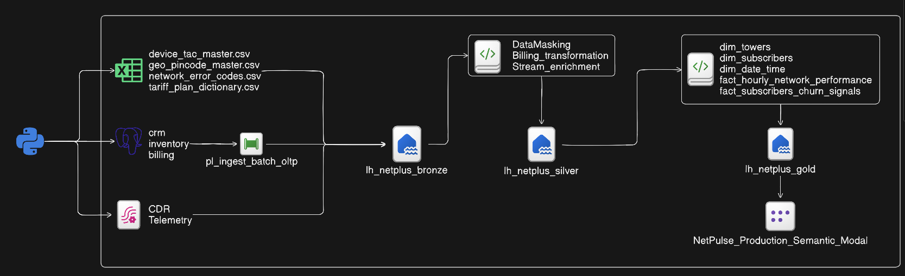

## What This Project Builds

- Synthetic telecom OLTP data for subscribers, KYC, SIM inventory, devices, billing, payment ledgers, data allowances, towers, and tower sectors.
- Static lookup datasets for geography, tariff plans, device TAC codes, and network error codes.
- Real-time CDR and tower telemetry producers that publish events to Microsoft Fabric Eventstreams.
- Fabric lakehouse layers for Bronze, Silver, and Gold processing.
- Fabric notebooks for data masking, Silver transformations, Gold dimensional modeling, and validation.
- Fabric pipelines for child ingestion workflows and master orchestration.
- A Power BI/Fabric semantic model for subscriber churn signals and hourly network performance reporting.
- Deployment and source-control structure suitable for Azure Repos and Fabric deployment pipelines.

## Repository Structure

```text
project-netpulse/
|-- config/
|   `-- database.ini
|-- data/
|   `-- static/
|       |-- device_tac_master.csv
|       |-- geo_pincode_master.csv
|       |-- network_error_codes.csv
|       `-- tariff_plan_dictionary.csv
|-- fabric/
|   |-- Eventstream/
|   |-- Lakehouse/
|   |-- Notebook/
|   |-- Pipeline/
|   |-- Semantic Model/
|   `-- NetPulse_Subscriber_Churn_Evaluation.MLExperiment/
|-- ScreenShots/
|-- src/
|   |-- track1_batch/
|   |   `-- db_initializer.py
|   |-- track2_static/
|   |   `-- csv_generator.py
|   `-- track3_streaming/
|       |-- cdr_producer.py
|       `-- telemetry_producer.py
|-- .env.example
|-- requirements.txt
`-- README.md
```

## Data Engineering Tracks

### Track 1: Batch OLTP Source

`src/track1_batch/db_initializer.py` creates and populates a PostgreSQL source system with normalized telecom schemas:

- `crm`
- `inventory`
- `billing`
- `network_infra`

The script supports append-style incremental loading through the `APPEND_MODE` environment variable.

### Track 2: Static Reference Data

`src/track2_static/csv_generator.py` generates offline static CSV dimensions under `data/static/`:

- Geography and pincode master
- Tariff plan dictionary
- Network error code dictionary
- Device TAC master

### Track 3: Real-Time Streaming

The streaming producers publish simulated live events to Microsoft Fabric Eventstreams:

- `src/track3_streaming/cdr_producer.py` sends call detail record events.
- `src/track3_streaming/telemetry_producer.py` sends tower and sector telemetry events.

## Fabric Assets

The `fabric/` folder contains exported Fabric items, including:

- Eventstreams for CDR and telemetry ingestion.
- Bronze, Silver, and Gold Lakehouses.
- Data masking, Silver, Gold, and testing notebooks.
- Child and master data pipelines.
- Semantic model definitions and table metadata.
- Subscriber churn ML experiment metadata.

## Prerequisites

- Python 3.10 or later
- PostgreSQL
- Microsoft Fabric workspace
- Fabric Eventstream connection strings
- Azure Repos or Git integration, if deploying through source control

## Local Setup

1. Clone the repository and move into the project folder.

```powershell
git clone <repo-url>
cd project-netpulse
```

2. Create and activate a Python virtual environment.

```powershell
python -m venv .venv
.\.venv\Scripts\Activate.ps1
```

3. Install dependencies.

```powershell
pip install -r requirements.txt
```

4. Create a local `.env` file from the example.

```powershell
Copy-Item .env.example .env
```

5. Update `.env` with your PostgreSQL and Fabric Eventstream settings.

```env
DB_HOST=localhost
DB_PORT=5432
DB_NAME=netpulse_oltp
DB_USER=postgres
DB_PASSWORD=admin

FABRIC_CDR_CONNECTION_STRING="Endpoint=sb://..."
FABRIC_TELEMETRY_CONNECTION_STRING="Endpoint=sb://..."
```

## Run the Project

Generate the PostgreSQL OLTP source data:

```powershell
python src\track1_batch\db_initializer.py
```

Generate static reference CSV files:

```powershell
python src\track2_static\csv_generator.py
```

Start the CDR streaming producer:

```powershell
python src\track3_streaming\cdr_producer.py
```

Start the telemetry streaming producer:

```powershell
python src\track3_streaming\telemetry_producer.py
```

## Fabric Pipeline Flow

The Fabric implementation follows this logical flow:

1. Ingest PostgreSQL batch data and static files into Bronze.
2. Receive live CDR and telemetry events through Fabric Eventstreams.
3. Apply masking and Silver transformations.
4. Build Gold dimensional and fact tables.
5. Orchestrate ingestion and transformation through child pipelines and the master pipeline.
6. Expose curated Gold data through the semantic model.
7. Deploy workspace assets through Fabric deployment pipeline and Azure Repo integration.

## Screenshots

### Fabric Workspace

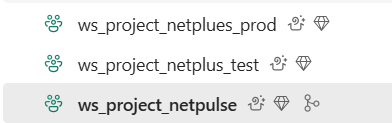

### Folder Structure

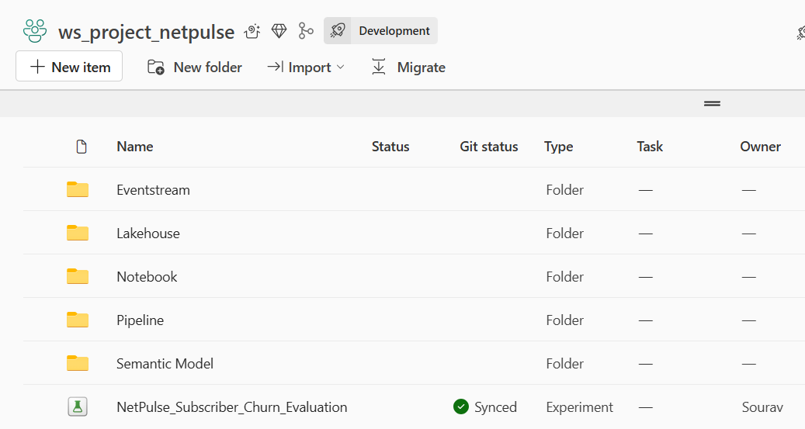

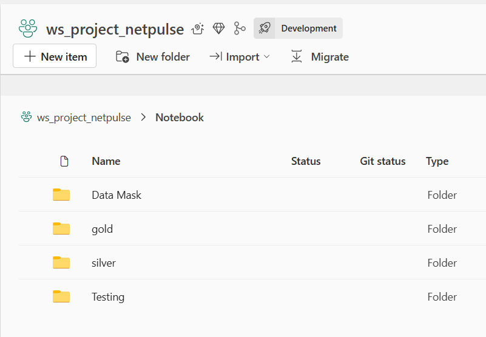

### Child Pipelines

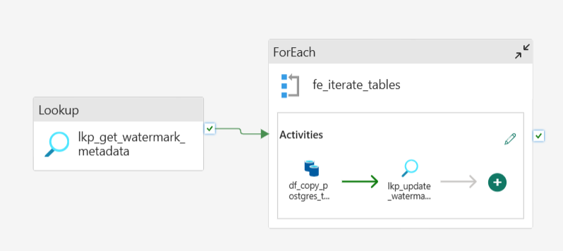

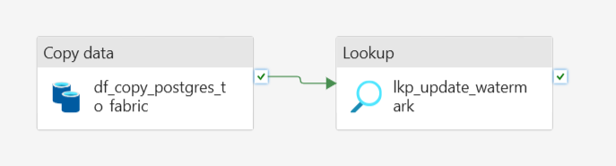

### Master Pipeline

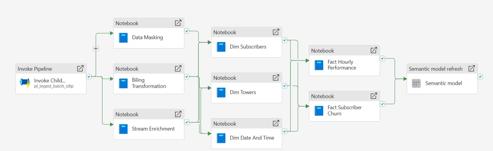

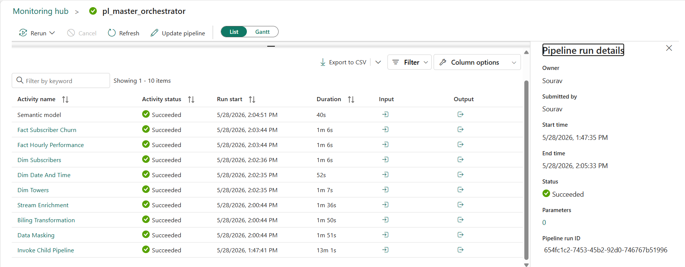

### Semantic Model and Data Model

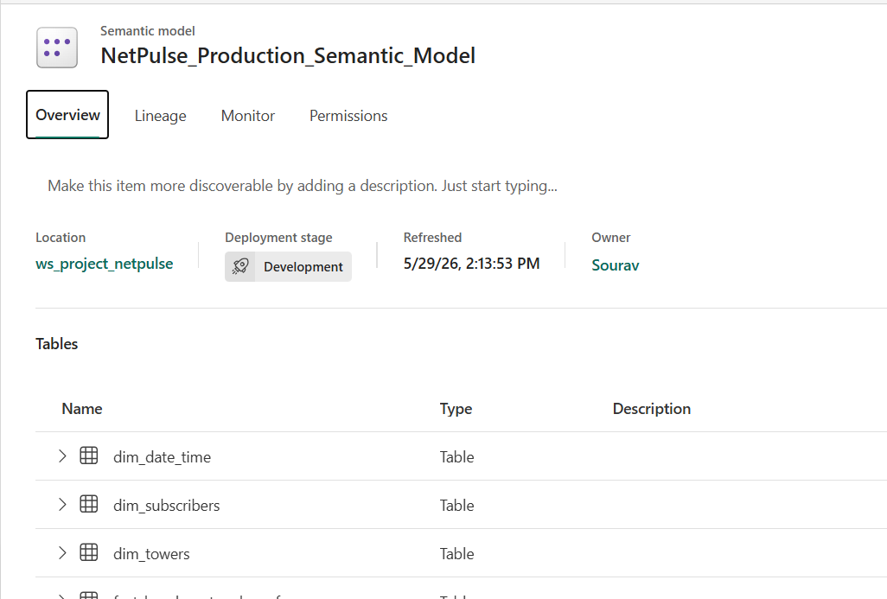

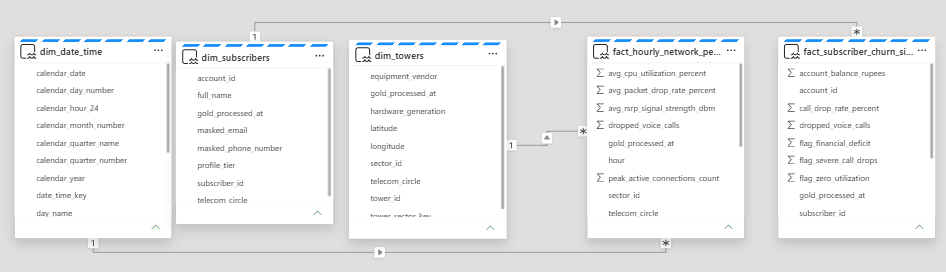

### Deployment Pipeline

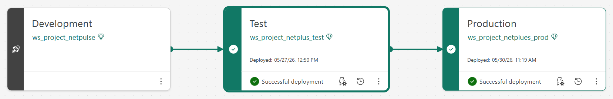

### Azure Repo Integration

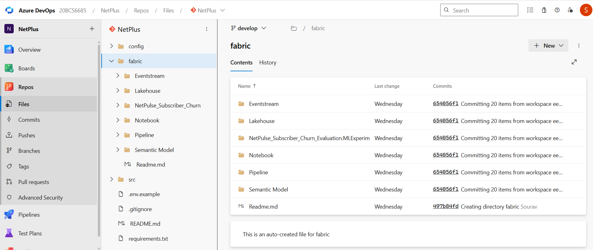

## Notes

- The local `.env` file contains secrets and should not be committed.
- The generated data is synthetic and intended for data engineering demonstrations.
- The Fabric item exports are stored as source-controlled artifacts under the `fabric/` folder.
